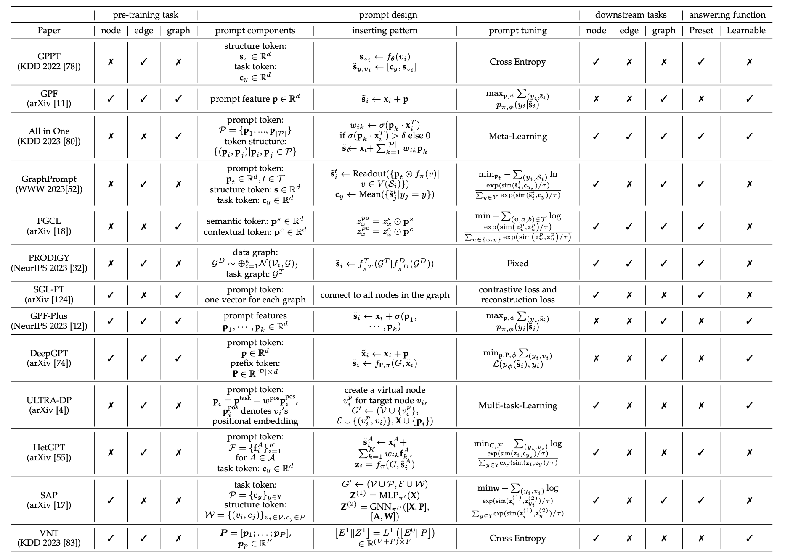

<h1 align="center"> Awesome-Graph-Prompt</h2>
<h5 align="center">A collection of AWESOME things about performing prompt learning on Graphs.</h5>

<h5 align="center">
  
   

</h5>


Recently, the workflow of **"pre-train, fine-tune"** has been shown less effective and efficient when dealing with diverse downstream tasks on graph domain.
Inspired by the prompt learning in natural language processing (NLP) domain, the **"pre-train, prompt"** workflow has emerged as a promising solution. 

This repo aims to provide a curated list of research papers that explore the prompt learning on graphs. 
**It is based on our Survey Paper: [Graph Prompt Learning: A Comprehensive Survey and Beyond](https://arxiv.org/abs/2311.16534)**. 
We will try to make this list updated frequently. If you found any error or any missed paper, please don't hesitate to open issues or pull requests.🌹


## Table of Contents

- [Awesome-Graph-Prompt](#awesome-graph-prompt)
  - [Table of Contents](#table-of-contents)
  - [GNN Prompting Papers](#gnn-prompting-papers)
  - [Multi-Modal Prompting with Graphs](#multi-modal-prompting-with-graphs)
     - [Prompt in Text-Attributed Graphs](#prompt-in-text-attributed-graphs)
     - [Large Language Models in Graph Data Processing](#large-language-models-in-graph-data-processing)
     - [Multi-modal Fusion with Graph and Prompting](#multi-modal-fusion-with-graph-and-prompting)
  - [Graph Domain Adaptation with Prompting](#graph-domain-adaptation-with-prompting)
  - [Application Papers](#application-papers)
     - [Dynamic Graphs](#dynamic-graphs)
     - [Social Networks](#social-networks)
     - [Recommender Systems](#recommender-systems)
     - [Knowledge Graph](#knowledge-graph)
     - [Biology](#biology)
     - [Others](#others)
  - [Other Resources](#other-resources)
     - [Open Source](#open-source)
     - [Benchmarks](#benchmarks)
     - [Datasets](#datasets)
     - [Online Talks](#online-talks)
     - [Blogs](#blogs)
  - [Contributing](#contributing)
  - [Citation](#citation)
  


## GNN Prompting Papers

Summary of existing representative works on graph prompt. $\mathcal{S}$: Subgraph. $V(\mathcal{S})$: Node set within subgraph $\mathcal{S}$. $\pi$: Pre-trained parameters. $\phi$: Task head parameters. $\theta$: Prompt parameters.  $\widetilde{\mathbf{s}}$: Filled prompt.




1. **Does Graph Prompt Work? A Data Operation Perspective with Theoretical Analysis.**
    In **arXiv**, [[Paper](https://arxiv.org/abs/2410.01635)].

        

   
2. **GPPT: Graph Pre-training and Prompt Tuning to Generalize Graph Neural Networks**.
   In **KDD'2022**, [[Paper](https://dl.acm.org/doi/10.1145/3534678.3539249 )]  [[Code](https://github.com/MingChen-Sun/GPPT)].

        

3. **SGL-PT: A Strong Graph Learner with Graph Prompt Tuning**.
   In **arXiv**, [[Paper](https://arxiv.org/abs/2302.12449)].
   
      


4. **GraphPrompt: Unifying Pre-Training and Downstream Tasks for Graph Neural Networks**.
   In **WWW'2023**, [[Paper](https://dl.acm.org/doi/10.1145/3543507.3583386 )] [[Code](https://github.com/Starlien95/GraphPrompt )].

      

5. **All in One: Multi-Task Prompting for Graph Neural Networks**.
   In **KDD'2023** Best Paper Award 🌟, [[Paper](https://arxiv.org/abs/2307.01504 )]  [[Code](https://github.com/sheldonresearch/ProG)].

     

6. **Deep Graph Reprogramming**.
   In **CVPR'2023** Highlight 🌟, [[Paper](https://openaccess.thecvf.com/content/CVPR2023/papers/Jing_Deep_Graph_Reprogramming_CVPR_2023_paper.pdf)].

      

7. **Virtual Node Tuning for Few-shot Node Classification**.
   In **KDD'2023**, [[Paper](https://arxiv.org/abs/2306.06063)].

     

8. **PRODIGY: Enabling In-context Learning Over Graphs**.
   In **NeurIPS'2023** Spotlight 🌟, [[Paper](https://arxiv.org/abs/2305.12600)] [[Code](https://github.com/snap-stanford/prodigy )].

     

9. **Universal Prompt Tuning for Graph Neural Networks**.
   In **NeurIPS'2023**, [[Paper](https://arxiv.org/abs/2209.15240)] [[Code](https://github.com/LuckyTiger123/GPF)].

      

10. **Deep Prompt Tuning for Graph Transformers**.
   In **arXiv**, [[Paper](https://arxiv.org/abs/2309.10131)].

      

11. **Prompt Tuning for Multi-View Graph Contrastive Learning**.
   In **arXiv**, [[Paper](https://arxiv.org/abs/2310.10362)].

       

12. **ULTRA-DP:Unifying Graph Pre-training with Multi-task Graph Dual Prompt**.
    In **arXiv**, [[Paper](https://arxiv.org/abs/2310.14845)].

        

13. **HetGPT: Harnessing the Power of Prompt Tuning in Pre-Trained Heterogeneous Graph Neural Networks**.
    In **WWW'2024**, [[Paper](https://arxiv.org/abs/2310.15318)].

        

14. **Enhancing Graph Neural Networks with Structure-Based Prompt**.
    In **arXiv**, [[Paper](https://arxiv.org/abs/2310.17394)].

       

15. **Generalized Graph Prompt: Toward a Unification of Pre-Training and Downstream Tasks on Graphs**.
    In **TKDE'2024**, [[Paper](https://arxiv.org/abs/2311.15317)] [[Code](https://github.com/gmcmt/graph_prompt_extension)].

       


16. **HGPROMPT: Bridging Homogeneous and Heterogeneous Graphs for Few-shot Prompt Learning**.
    In **AAAI'2024**, [[Paper](https://arxiv.org/abs/2312.01878)] [[Code](https://github.com/Starlien95/HGPrompt)].

        


17. **MultiGPrompt for Multi-Task Pre-Training and Prompting on Graphs**.
    In **WWW'2024**, [[Paper](https://arxiv.org/abs/2312.03731)] [[Code](https://github.com/Nashchou/MultiGPrompt)].

        

18. **Subgraph-level Universal Prompt Tuning**.
    In **arXiv**, [[Paper](https://arxiv.org/pdf/2402.10380.pdf)] [[Code](https://anonymous.4open.science/r/SUPT-F7B1/)].

       

19. **Inductive Graph Alignment Prompt: Bridging the Gap between Graph Pre-training and Inductive Fine-tuning From Spectral Perspective**.
    In **WWW'2024**, [[Paper](https://arxiv.org/pdf/2402.13556.pdf)].

       


20. **A Unified Graph Selective Prompt Learning for Graph Neural Networks**.
    In **arXiv**, [[Paper](https://arxiv.org/pdf/2406.10498)].

       


## Multi-Modal Prompting with Graphs

### Prompt in Text-Attributed Graphs 

1. **Augmenting Low-Resource Text Classification with Graph-Grounded Pre-training and Prompting**.
   In **SIGIR'2023**, [[Paper](https://arxiv.org/abs/2305.03324 )] [[Code](https://github.com/WenZhihao666/G2P2 )]. 

2. **Prompt Tuning on Graph-augmented Low-resource Text Classification**.
   In **arXiv**, [[Paper](https://arxiv.org/abs/2307.10230 )] [[Code](https://github.com/WenZhihao666/G2P2-conditional )]. 

3. **Prompt-Based Zero- and Few-Shot Node Classification: A Multimodal Approach**. 
   In **arXiv**, [[Paper](https://arxiv.org/abs/2307.11572 )]. 

4. **Prompt-based Node Feature Extractor for Few-shot Learning on Text-Attributed Graphs**. 
   In **arXiv**, [[Paper](https://arxiv.org/abs/2309.02848 )].

5. **Large Language Models as Topological Structure Enhancers for Text-Attributed Graphs**.
   In **arXiv**, [[Paper](https://arxiv.org/pdf/2311.14324.pdf )].

6. **ZeroG: Investigating Cross-dataset Zero-shot Transferability in Graphs**.
   In **KDD'2024**, [[Paper](https://arxiv.org/abs/2402.11235)] [[Code](https://github.com/NineAbyss/ZeroG)].

7. **Pre-Training and Prompting for Few-Shot Node Classification on Text-Attributed Graphs**.
   In **KDD'2024**, [[Paper](https://arxiv.org/abs/2407.15431)] [[Code](https://github.com/THUDM/P2TAG)].


### Large Language Models in Graph Data Processing

> 
>  For this research line, please refer to **Awesome LLMs with Graph Tasks** [[Survey Paper](https://arxiv.org/abs/2311.12399) | [Github Repo](https://github.com/yhLeeee/Awesome-LLMs-in-Graph-tasks)]
> 
>  We **highly recommend** this work as they have provided a comprehensive survey to summarize the works on the integration of **LLM and Graph** 👍 


### Multi-modal Fusion with Graph and Prompting

1. **GraphAdapter: Tuning Vision-Language Models With Dual Knowledge Graph**.
   In **NeurIPS'2023**, [[Paper](http://arxiv.org/abs/2309.13625)] [[Code](https://github.com/lixinustc/GraphAdapter )]. `Graph+Text+Image`

2. **SynerGPT: In-Context Learning for Personalized Drug Synergy Prediction and Drug Design**.
   In **arXiv**, [[Paper](http://arxiv.org/abs/2307.11694)]. `Graph+Text`

3. **Which Modality should I use - Text, Motif, or Image? Understanding Graphs with Large Language Models**.
    In **arXiv**, [[Paper](https://arxiv.org/pdf/2311.09862.pdf)]. `Graph+Text+Image`


## Graph Domain Adaptation with Prompting

1. **GraphGLOW: Universal and Generalizable Structure Learning for Graph Neural Networks**.
   In **KDD'2023**, [[Paper](https://arxiv.org/pdf/2306.11264.pdf)] [[Code](https://github.com/WtaoZhao/GraphGLOW )].

   

2. **GraphControl: Adding Conditional Control to Universal Graph Pre-trained Models for Graph Domain Transfer Learning**.
   In **WWW'2024**, [[Paper](https://arxiv.org/abs/2310.07365)] [[Code](https://github.com/wykk00/GraphControl)] [[Chinese Blog](https://zhuanlan.zhihu.com/p/680351601)].

     

3. **All in One and One for All: A Simple yet Effective Method towards Cross-domain Graph Pretraining**.
   In **KDD'2024**, [[Paper](https://arxiv.org/abs/2402.09834)] [[Code](https://github.com/cshhzhao/GCOPE)].

   

4. **Text-Free Multi-domain Graph Pre-training: Toward Graph Foundation Models**.
   In **arXiv**, [[Paper](https://arxiv.org/abs/2405.13934)].


## Application Papers

### Dynamic Graphs
1. **Prompt Learning on Temporal Interaction Graphs**.
   In **arXiv**, [[Paper](https://arxiv.org/abs/2402.06326)].
2. **Prompt-Enhanced Spatio-Temporal Graph Transfer Learning**.
   In **arXiv**, [[Paper](https://arxiv.org/abs/2405.12452)].
3. **DyGPrompt: Learning Feature and Time Prompts on Dynamic Graphs**.
   In **arXiv**, [[Paper](https://arxiv.org/abs/2405.13937)].

### Social Networks
1. **Prompt-and-Align: Prompt-Based Social Alignment for Few-Shot Fake News Detection**.
   In **CIKM'2023**, [[Paper](https://arxiv.org/pdf/2309.16424.pdf )] [[Code](https://github.com/jiayingwu19/Prompt-and-Align)]. `Fake News Detection`
2. **Voucher Abuse Detection with Prompt-based Fine-tuning on Graph Neural Networks**.
   In **CIKM'2023**, [[Paper](https://arxiv.org/abs/2308.10028 )]. `Fraud Detection`
3. **ProCom: A Few-shot Targeted Community Detection Algorithm**.
   In **KDD'2024**, [[Paper](https://arxiv.org/abs/2408.07369)] [[Code](https://github.com/WxxShirley/KDD2024ProCom)]. `Community Detection`


### Recommender Systems
1. **Contrastive Graph Prompt-tuning for Cross-domain Recommendation**.
   In **TOIS'2023**, [[Paper](https://arxiv.org/pdf/2308.10685.pdf )]. `Cross-domain Recommendation`
2. **An Empirical Study Towards Prompt-Tuning for Graph Contrastive Pre-Training in Recommendations**.
   In **NeurIPS'2023**, [[Paper](https://openreview.net/pdf?id=XyAP8ScqLV)] [[Code](https://github.com/Haoran-Young/CPTPP )]. `General Recommendation`
3. **Motif-Based Prompt Learning for Universal Cross-Domain Recommendation**.
   In **WSDM'2024**, [[Paper](https://arxiv.org/abs/2310.13303)]. `Cross-domain Recommendation`
4. **GraphPro: Graph Pre-training and Prompt Learning for Recommendation**.
   In **WWW'2024**, [[Paper](https://arxiv.org/abs/2311.16716)] [[Code](https://github.com/HKUDS/GraphPro)].  `General Recommendation`
5. **GPT4Rec: Graph Prompt Tuning for Streaming Recommendation**.
   In **SIGIR'2024**, [[Paper](https://arxiv.org/pdf/2406.08229)]. `General Recommendation`

### Knowledge Graph
1. **Structure Pretraining and Prompt Tuning for Knowledge Graph Transfer**.
   In **WWW'2023**, [[Paper](https://arxiv.org/pdf/2303.03922.pdf )] [[Code](https://github.com/zjukg/KGTransformer )]. 
2. **Graph Neural Prompting with Large Language Models**.
   In **AAAI'2024**, [[Paper](https://arxiv.org/pdf/2309.15427.pdf)].
3. **Knowledge Graph Prompting for Multi-Document Question Answering**.
   In **arXiv**, [[Paper](https://arxiv.org/abs/2308.11730 )] [[Code](https://github.com/YuWVandy/KG-LLM-MDQA )].
4. **Multi-domain Knowledge Graph Collaborative Pre-training and Prompt Tuning for Diverse Downstream Tasks**.
   In **arXiv**, [[Paper](https://arxiv.org/abs/2405.13085)] [[Code](https://github.com/zjukg/MuDoK)].
   

### Biology
1. **Can Large Language Models Empower Molecular Property Prediction?**
   In **arXiv**, [[Paper](https://arxiv.org/pdf/2307.07443.pdf)] [[Code](https://github.com/ChnQ/LLM4Mol)].
2. **GIMLET: A Unified Graph-Text Model for Instruction-Based Molecule Zero-Shot Learning**.
   In **NeurIPS'2023**, [[Paper](https://arxiv.org/pdf/2306.13089.pdf)] [[Code](https://github.com/zhao-ht/GIMLET )].
3. **MolCA: Molecular Graph-Language Modeling with Cross-Modal Projector and Uni-Modal Adapter**.
   In **EMNLP'2023**, [[Paper](http://arxiv.org/abs/2310.12798)] [[Code](https://github.com/acharkq/MolCA)].
4. **ReLM: Leveraging Language Models for Enhanced Chemical Reaction Prediction**.
   In **EMNLP'2023**, [[Paper](https://arxiv.org/pdf/2310.13590.pdf)] [[Code](https://github.com/syr-cn/ReLM)].
5. **MolCPT: Molecule Continuous Prompt Tuning to Generalize Molecular Representation Learning**.
   In **WSDM'2024**, [[Paper](https://arxiv.org/abs/2212.10614)].
6. **Protein Multimer Structure Prediction via PPI-guided Prompt Learning**.
   In **ICLR'2024**, [[Paper](https://openreview.net/forum?id=OHpvivXrQr)].
7. **DDIPrompt: Drug-Drug Interaction Event Prediction based on Graph Prompt Learning**.
   In **CIKM'2024**, [[Paper](https://arxiv.org/abs/2402.11472)].


### Others
1. **A Data-centric Framework to Endow Graph Neural Networks with Out-Of-Distribution Detection Ability**.
   In **KDD'2023**, [[Paper](https://dl.acm.org/doi/abs/10.1145/3580305.3599244)] [[Code](https://github.com/BUPT-GAMMA/AAGOD )]. `OOD Detection`
2. **MMGPL: Multimodal Medical Data Analysis with Graph Prompt Learning**.
   In **arXiv**, [[Paper](https://arxiv.org/abs/2312.14574)]. 
3. **Instruction-based Hypergraph Pretraining**.
   In **SIGIR'2024**, [[Paper](https://arxiv.org/abs/2403.19063)]. `Hypergraph Prompt`
4. **Cross-Context Backdoor Attacks against Graph Prompt Learning**.
   In **KDD'2024**, [[Paper](https://arxiv.org/pdf/2405.17984)] [[Code](https://github.com/xtLyu/CrossBA)]. `Cross-Context Backdoor Attacks`
5. **Urban Region Pre-training and Prompting: A Graph-based Approach**.
   In **arXiv**, [[Paper](https://arxiv.org/abs/2408.05920)]. `Urban Region Representation`
   


## Other Resources

### Open Source
* **ProG: A Unified Library for Graph Prompting** [[Website](https://graphprompt.github.io/)] [[Code](https://github.com/sheldonresearch/ProG)]
  
  ProG (Prompt Graph) is a library built upon PyTorch to easily conduct single or multiple task prompting for a pre-trained Graph Neural Networks (GNNs).


### Benchmarks

* **ProG: A Graph Prompt Learning Benchmark** [[Paper](https://arxiv.org/pdf/2406.05346)]

  ProG benchmark integrates **SIX** pre-training methods and **FIVE** state-of-the-art graph prompt techniques, evaluated across **FIFTEEN** diverse datasets to assess **performance, flexibility, and efficiency**.

### Datasets

Datasets that are commonly used in GNN prompting papers.

<details close>
  <summary>Citation Networks</summary>
  
  |     Dataset      | \#Node        | \#Edge        | \#Feature | \#Class |
  | :--------------: | :-----------: | :-----------: | :-------: | :-----: |
  |       Cora       |     2708      |     5429      |   1433    |    7    |
  |     CoraFull     |     19793     |     63421     |   8710    |   70    |
  |     Citeseer     |     3327      |     4732      |   3703    |    6    |
  |      DBLP        |     17716     |     105734    |   1639    |    4    |
  |      Pubmed      |     19717     |     44338     |    500    |    3    |
  |   Coauthor-CS    |     18333     |     81894     |   6805    |   15    |
  | Coauthor-Physics |     34493     |    247962     |   8415    |    5    |
  |    ogbn-arxiv    |    169343     |    1166243    |    128    |   40    |
  
</details>

<details close>
  <summary>Purchase Networks</summary>

  |     Dataset      | \#Node        | \#Edge        | \#Feature | \#Class |
  | :--------------: | :-----------: | :-----------: | :-------: | :-----: |
  | Amazon-Computers |     13752     |    245861     |    767    |   10    |
  |   Amazon-Photo   |    7650       |    119081     |    745    |    8    |
  |  ogbn-products   |   2449029     |   61859140    |    100    |   47    |
  
</details>


<details close>
  <summary>Social Networks</summary>

  |     Dataset      | \#Node        | \#Edge        | \#Feature | \#Class |
  | :--------------: | :-----------: | :-----------: | :-------: | :-----: |
  |      Reddit      |    232965     |   11606919    |    602    |   41    |
  |      Flickr      |     89250     |    899756     |     500   |    7    |
  
</details>

<details close>
  <summary>Molecular Graphs</summary>

  |     Dataset     | \#Graph | \#Node (Avg.) | \#Edge (Avg.) | \#Feature | \#Class |
  | :--------------:| :-----: | :-----------: | :-----------: | :-------: | :-----: |
  |       COX2      |   467   |     41.22     |     43.45     |     3     |    2    |
  |     ENZYMES     |   600   |     32.63     |     62.14     |     18    |    6    |
  |      MUTAG      |   188   |     17.93     |     19.79     |     7     |    2    |
  |       MUV       |  93087  |     24.23     |     26.28     |     -     |   17    |
  |       HIV       |  41127  |     25.53     |     27.48     |     -     |    2    |
  |      SIDER      |  1427   |     33.64     |     35.36     |     -     |   27    |
  
</details>

### Online Talks
* Official Presentation of **All in One** [Link](https://www.bilibili.com/video/BV1q94y1k7nF)

### Blogs
* A Chinese Blog that provides a comprehensive introduction of **ALL** graph prompting works [[Zhihu](https://zhuanlan.zhihu.com/p/681628720)]


## Contributing
👍 Contributions to this repository are welcome! 

If you have come across relevant resources, feel free to open an issue or submit a pull request.


## Citation

If you find this repo helpful to you, please feel free to cite these works:


[Survey Paper](https://arxiv.org/abs/2311.16534)
```latex
@article{sun2023graph,
  title = {Graph Prompt Learning: A Comprehensive Survey and Beyond},
  author = {Sun, Xiangguo and Zhang, Jiawen and Wu, Xixi and Cheng, Hong and Xiong, Yun and Li, Jia},
  year = {2023},
  journal = {arXiv:2311.16534},
  eprint = {2311.16534},
  archiveprefix = {arxiv}
}
```


[Tutorial](https://dl.acm.org/doi/abs/10.1145/3637528.3671456)
```latex
@inproceedings{li2024graph,
  title={Graph Intelligence with Large Language Models and Prompt Learning},
  author={Li, Jia and Sun, Xiangguo and Li, Yuhan and Li, Zhixun and Cheng, Hong and Yu, Jeffrey Xu},
  booktitle={Proceedings of the 30th ACM SIGKDD Conference on Knowledge Discovery and Data Mining},
  pages={6545--6554},
  year={2024}
}

```


[ProG Library](https://github.com/sheldonresearch/ProG)
```latex
@inproceedings{sun2023all,
  title={All in One: Multi-Task Prompting for Graph Neural Networks},
  author={Sun, Xiangguo and Cheng, Hong and Li, Jia and Liu, Bo and Guan, Jihong},
  booktitle={Proceedings of the 26th ACM SIGKDD international conference on knowledge discovery \& data mining (KDD'23)},
  year={2023},
  pages = {2120–2131},
  location = {Long Beach, CA, USA},
  isbn = {9798400701030},
  url = {https://doi.org/10.1145/3580305.3599256},
  doi = {10.1145/3580305.3599256}
}
```

[Theoretical Support](https://arxiv.org/abs/2410.01635)
```latex
@article{wang2024does,
      title={Does Graph Prompt Work? A Data Operation Perspective with Theoretical Analysis}, 
      author={Qunzhong Wang and Xiangguo Sun and Hong Cheng},
      year={2024},
      journal = {arXiv preprint arXiv:2410.01635},
      url={https://arxiv.org/abs/2410.01635}
}
```


Other Representative Works:

🔥 **All in One** A Representative GNN Prompting Framework
  ```latex
  @inproceedings{sun2023all,
    title={All in One: Multi-Task Prompting for Graph Neural Networks},
    author={Sun, Xiangguo and Cheng, Hong and Li, Jia and Liu, Bo and Guan, Jihong},
    booktitle={Proceedings of the 26th ACM SIGKDD international conference on knowledge discovery \& data mining (KDD'23)},
    year={2023},
    pages = {2120–2131},
    location = {Long Beach, CA, USA},
    isbn = {9798400701030},
    url = {https://doi.org/10.1145/3580305.3599256},
    doi = {10.1145/3580305.3599256}
  }
 ```
 

🔥 **All in One and One for All** A Cross-domain Graph Pre-training Framework
  ```latex
  @article{zhao2024all,
    title={All in One and One for All: A Simple yet Effective Method towards Cross-domain Graph Pretraining}, 
    author={Haihong Zhao and Aochuan Chen and Xiangguo Sun and Hong Cheng and Jia Li},
    year={2024},
    eprint={2402.09834},
    archivePrefix={arXiv}
  }
  ```

🔥 **TIGPrompt** A Temporal Interation Graph Prompting Framework
  ```latex
  @article{chen2024prompt,
    title={Prompt Learning on Temporal Interaction Graphs}, 
    author={Xi Chen and Siwei Zhang and Yun Xiong and Xixi Wu and Jiawei Zhang and Xiangguo Sun and Yao Zhang and Yinglong Zhao and Yulin Kang},
    year={2024},
    eprint={2402.06326},
    archivePrefix={arXiv},
    journal = {arXiv:2402.06326}
  }
  ```

🔥 **Graph Prompting Works on Biology Domain** 
  ```latex
  @inproceedings{gao2024protein,
    title={Protein Multimer Structure Prediction via {PPI}-guided Prompt Learning},
    author={Ziqi Gao and Xiangguo Sun and Zijing Liu and Yu Li and Hong Cheng and Jia Li},
    booktitle={The Twelfth International Conference on Learning Representations (ICLR)},
    year={2024},
    url={https://openreview.net/forum?id=OHpvivXrQr}
  }

  @article{wang2024ddiprompt,
    title={DDIPrompt: Drug-Drug Interaction Event Prediction based on Graph Prompt Learning}, 
    author={Yingying Wang and Yun Xiong and Xixi Wu and Xiangguo Sun and Jiawei Zhang},
    year={2024},
    eprint={2402.11472},
    archivePrefix={arXiv},
    journal = {arXiv:2402.11472}
  }
  ``` 

  🔥 **Graph Prompting Works on Urban Computing** 
   ```latex
  @article{jin2024urban,
  title={Urban Region Pre-training and Prompting: A Graph-based Approach},
  author={Jin, Jiahui and Song, Yifan and Kan, Dong and Zhu, Haojia and Sun, Xiangguo and Li, Zhicheng and Sun, Xigang and Zhang, Jinghui},
  journal={arXiv preprint arXiv:2408.05920},
  year={2024}
}
```
